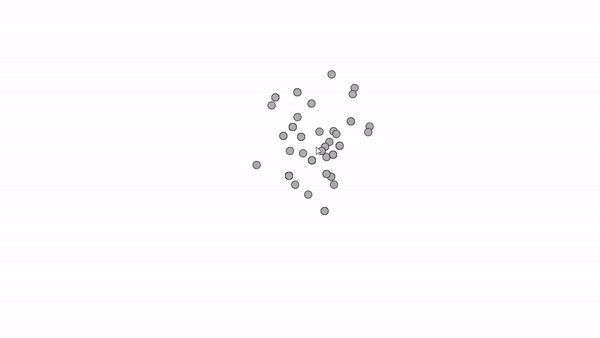

# Repte Processing 3
## Joviat - SDAMV2 - Pol Saña Lázaro 	

# :frog:

**Entrega 1**

> La classe Mover consta de 2 vectors de tipus PVector que seràn generats de forma aleatoria en el constructor de la classe.
> Al generar-se de forma aleatoria, farà que cada cop que executem el programa apraregui en un lloc diferent de la pantalla i tingui
> una velocitat diferent. Si toca un dels laterals de la pantalla, sortirà a la banda contraria mantenint la direcció.

**Entrega 2**

> Només afegint un nou objecte de tipus PVector i inicialitzant-lo així "acceleracio = new PVector(0, 1)", aconseguim que l'objecte es mogui de forma verticalment descendent.

**Entrega 3**

> Canviant els valors de l'inicialitzaicó de l'acceleracio per "acceleracio = new PVector(random(-2,2),random(-2,2))", aconseguim que l'objecte acceleri de forma diferent cada cop.
> En cada frame del draw() s'augmenta la posició X i Y del objecte segons la suma de la velocitat actual + l'acceleracio. Això fa que cada cop vagi més ràpid.

**Entrega 4**

**Entrega 5**

>

**Entrega 6**

